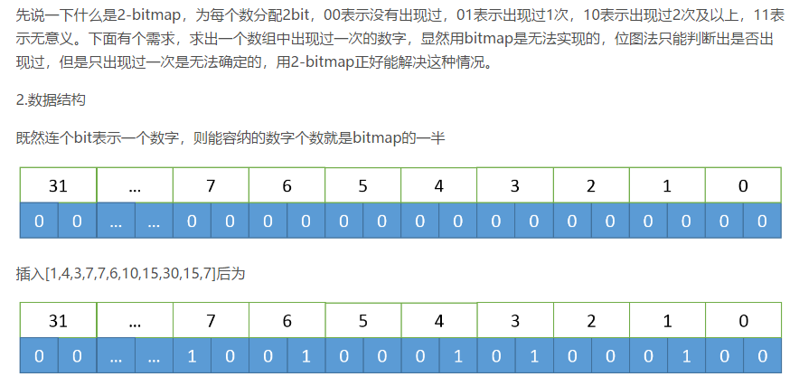

## 算法面试题整理

### 二分查找（面试遇到的）

时间复杂度：O(logN)

```java
public static int binarySearch(int arr[], int key){
    int len = arr.length;
    int left = 0, right = len-1;
    while(left <= right){
        int min = (left + right)/2;
        if(arr[min] > key)
            right = min-1;
        if(arr[min] < key)
            left = min+1;
        if(arr[min] == key)
            return min;
    }
    return -1;
}
```


### 归并排序（面试遇到的）

时间复杂度：O(N*logN)

普通实现代码

```java
public static void mergeSortUp2Down(int[] a, int start, int end) {
    if(a==null || start >= end)
        return ;
    int mid = (end + start)/2;
    mergeSortUp2Down(a, start, mid); // 递归排序a[start...mid]
    mergeSortUp2Down(a, mid+1, end); // 递归排序a[mid+1...end]
    merge(a, start, mid, end);
}

public static void merge(int[] a, int start, int mid, int end) {
    int[] tmp = new int[end-start+1];
    int i = start;
    int j = mid + 1;
    int k = 0; 

    while(i <= mid && j <= end) {
        if (a[i] <= a[j])
            tmp[k++] = a[i++];
        else
            tmp[k++] = a[j++];
    }

    while(i <= mid)
        tmp[k++] = a[i++];

    while(j <= end)
        tmp[k++] = a[j++];

    for (i = 0; i < k; i++)
        a[start + i] = tmp[i];
    tmp=null;
}
```


多种优化代码

```java
public static void sort(int[] a) {
    int[] aux = new int[a.length];
    // 优化方案①：直接将辅助数组作为参数传入
    mergeSort(a, 0, a.length - 1, aux);
}

public static void mergeSort(int[] a, int lo, int hi, int[] aux) {
    if (hi <= lo)
        return;
    int mid = lo + (hi - lo) / 2;
    mergeSort(a, lo, mid, aux);
    mergeSort(a, mid + 1, hi, aux);

    //优化方案②：判断测试数组是否已经有序
    if (!less(aux[mid + 1], aux[mid])) {
        System.arraycopy(aux, lo, a, lo, hi - lo + 1);
        return;
    }

    // 优化方案③：merge() 方法中不将元素复制到辅助数组
    merge(a, lo, mid, hi, aux);

}

private static boolean less(Comparable comparableA, Comparable comparableB) {
    return comparableA.compareTo(comparableB) < 0;
}

public static void merge(int[] a, int lo, int mid, int hi, int[] aux) {
    int i = lo, j = mid + 1;
    for (int k = lo; k <= hi; k++) {
        aux[k] = a[k];
    }
    for (int k = lo; k <= hi; k++) {
        if (i > mid)
            a[k] = aux[j++];
        else if (j > hi)
            a[k] = aux[i++];
        else if (aux[i] <= aux[j])
            a[k] = aux[i++];
        else
            a[k] = aux[j++];
    }
}
```

其他优化：可以在数组较小的时候进行插入排序，可以提升性能的10%-15%

拓展：堆排

```java
public static void sort(int[] arr){
        int len = arr.length;
        for(int i = len/2-1; i>=0; i--){
            adjustHeap(arr, i, len);
        }

        for(int j = len-1; j > 0; j--){
            swap(arr, 0, j);
            adjustHeap(arr, 0, j);
        }
    }

    public static void adjustHeap(int[] arr, int i, int len){
        int temp = arr[i];
        for(int k = 2*i+1; k < len; k = 2*k+1){
            if(k+1 < len && arr[k] < arr[k+1])
                k++;

            if(arr[k] > temp){
                swap(arr, i, k);
                i = k;
            }else{
                break;
            }
        }
    }

    public static void swap(int[] arr, int a, int b){
        int temp = arr[a];
        arr[a] = arr[b];
        arr[b] = temp;
    }
```


### 实现未知数据量进行排序（面试遇到的）

这是在面试中经常遇到的问题，主要考思想，用到了分治的思想，既然是未知的数据量，那么我们不能盲目的去进行排序，首先想到的是，进行分治，如何分？

一般来说，对于数字来说，进行取模分区是比较常用的方法，将一组数据集，对1000（或100）取模，分为多个文件进行处理，之后，对各个文件进行排序，最后，归并排序。

### 给定a、b两个文件，各存放50亿个url，每个url各占64字节，内存限制是4G，让你找出a、b文件共同的url并且数量是最多的top5?（面试遇到的）

和上面的题目差不多，都是用的了分治的思想，不过用的方法不一样。

分析：50Gx64=320G >> 4G

（1）、分文件：对a文件中的url进行hash(url)%1000，储存到1000个小文件中，记为a0, a1, a2,...,a999，一个文件大小为333M；对于b文件也同样处理，b0,b1,b2,...,b999。

（2）、两两结合求top5，ai和bi合并（文件大小为666M），求出每个url的数量

（3）、所有文件合并求top5：将1000个文件进行合并，求出top5

### 平衡二叉树

时间复杂度O（logn）

扩展：B树（B-树）、B+树、B*树

### 双向队列原理

双向链表

拓展：环形链表(约瑟夫环)

### 算法设计

a数组 n个元素
b数组 n-1个元素
其中，数据乱序，范围有符号长整型，b数组比a数组只少一个元素，其他都相同。
问：设计算法，时间复杂度尽量低，找到这个元素。

- 方法一：布隆过滤器，说有不一定有，说没有一定没有。损失精度，空间小，但足以解决这个题

- 方法二：2-bitmap。精准，消耗空间大一点

### 2-bitmap



### 海量数据分布在 100 台电脑中，想个办法高校统计出这批数据的 TOP10。

1) 在每台电脑上求出 TOP10，可以采用包含 10 个元素的堆完成（TOP10 小，用最大堆，TOP10 大，用最小堆）。比如求 TOP10 大，我们首先取前 10 个元素调整成最小堆，如果发现，然后扫描后面的数据，并与堆顶元素比较，如果比堆顶元素大，那么用该元素替换堆顶，然后再调整为最小堆。最后堆中的元素就是 TOP10 大。

2) 求出每台电脑上的 TOP10 后，然后把这 100 台电脑上的 TOP10 组合起来，共 1000 个数据，再利用上面类似的方法求出 TOP10 就可以了。

### 1000 万字符串，其中有些是重复的，需要把重复的全部去掉，保留没有重复的字符串。请怎么设计和实现？

字典树


### 最大间隙问题

附加文档

### 倒排索引

单词对应：（所在文章、词频）

两种形式：链表和B树

链表：解决哈希冲突

B树：在叶子部分进行索引分布


### 外排序


